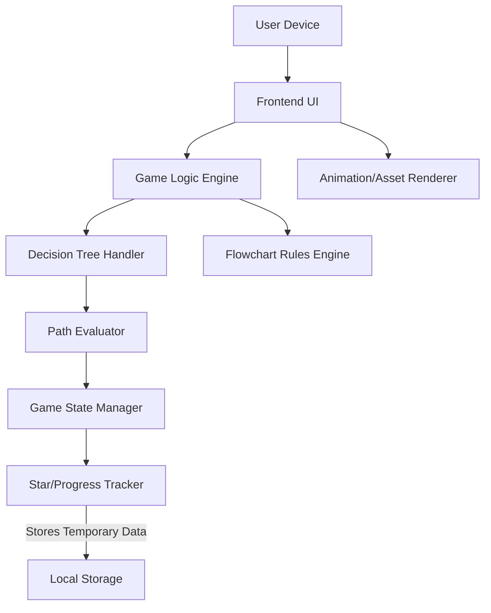
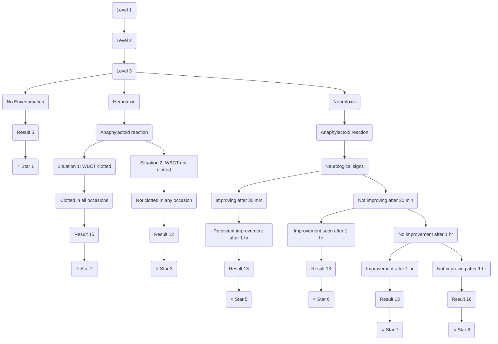

# 🐍 Snake-Bite Emergency Treatment Simulation Game
### An Interactive Medical Training Tool for Snake Bite Initial Treatment Management

**Snake-bite management** is a critical emergency skill for medical students. This project transforms essential treatment protocols into a gamified, interactive simulation where learners practice decision-making in real time.

This application helps students understand immediate management of **hemotoxic, neurotoxic, and no-envenomation** scenarios through step-wise branching situations.

## 🎯 Overview

This project is an **interactive, simulation-based training game** that mimics real-life scenarios of snake-bite management.
Students move through branching clinical conditions, make decisions, and learn the correct pathways for emergency care.

The entire gameplay is based on a structured clinical flowchart (attached below), covering:
**🟢 No Envenomation**
**🔴 Hemotoxic Envenomation**
**🔵 Neurotoxic Envenomation**

Each correct decision moves the student forward; completing a full path earns a **⭐ star**.
Collect **8 stars** to finish the training module.

## 🧠 Concept & Educational Goal

This game is designed to:

✔ Teach **clinical reasoning**

✔ Reinforce **step-wise emergency management**

✔ Introduce **treatment variations** for different snake toxins

✔ Encourage **active learning** through simulation

✔ Provide **instant feedback** via gamified progression

It shifts learning from passive memorization → to → **engaging, scenario-based problem solving.**

# 🧠 Medical Concepts Covered
This simulator reinforces critical emergency medicine concepts:

- **Triage:** Distinguishing between dry bites (No Envenomation) and wet bites.

- **Syndromic Approach:** Identifying Neurotoxic (Cobra/Krait) vs. Haemotoxic (Viper) bites without seeing the snake.

- **20WBCT:** Understanding the 20-minute Whole Blood Clotting Test as a primary diagnostic tool for viper bites.

- **Anaphylaxis Management:** Managing acute reactions to Anti-Snake Venom (ASV).

- **ASV Dosing protocols:** Knowing when to repeat doses based on persistent symptoms.

## 🕹️ How the Game Works
### 🔹 Step 1: Start the Case

A snake-bite patient appears with basic symptoms.

### 🔹 Step 2: You choose between available clinical evaluations.

### 🔹 Step 3: Based on decisions, the game branches into:

- No Envenomation

- Hemotoxic Reaction

- Neurotoxic Reaction

- Anaphylactoid Reaction

- Neurological Signs

- Coagulation Test Results (WBCT)

- Response to Treatment after 30 min / 1 hr

### 🔹 Step 4: Correct path → ⭐ Star

Wrong decisions redirect, educate, or end the scenario.

### 🔹 Step 5: Complete all 8 logical paths to win.
## 🌟 Features
### 🎮 Interactive Simulation

Click-based decision tree with dynamic progression.

### ⭐ Gamified Learning

Each completed path gives a star → total 8 stars.

### 🧪 Realistic Clinical Scenarios

Based on actual snake-bite emergency protocols.

### 🧭 Branching Decision Paths

Multiple clinical outcomes depending on learner choice.

### 📊 Flowchart-Driven Logic

All logic exactly follows the medical flow diagram.

### 📱 Responsive Design

Works on desktop, tablet, and mobile.


## 🏗️ System Architecture



## Key Architectural Concepts

**- Game Logic Engine:** Handles decisions, transitions, state changes

**- Rules Engine:** Implements clinical logic from the flowchart

**- Local Storage:** Saves stars & progress

**- UI Renderer:** Produces a smooth, interactive experience

## 🧬 Game Flow Logic

This Mermaid diagram recreates the branching structure from the flowchart image:


## 🚀 Technology Stack

**Frontend:** ReactJS, Tailwind CSS

**State Management:** Context API/ LocalStorage

**Gamification Engine:** Custom logic

**Design:** As per client requirement

## 🛠️ Installation & Setup
### 1️⃣ Clone the Repository
```
git clone https://github.com/snake-bite-game.git
cd snakebite-game
```

### 2️⃣ Install Dependencies
```npm install```

### 3️⃣ Start Development Server
```npm start```

### 4️⃣ Build for Production
```npm run build```

## 👨‍⚕️ Use Cases
### 🎓 Medical Colleges

Teach emergency response & decision-making to undergraduate students.

### 🏥 Training for Paramedics

Quick and actionable logic pathways.

### 🧪 Workshops & CMEs

Interactive demonstration during clinical skill sessions.

### 🩺 Self-Learning

Students can test and reinforce clinical knowledge.

## 📌 Future Enhancements

- ⏳ Timer-based emergency scenarios

- 🔊 Audio explanations of steps

- 👨‍⚕️ AI-based mentor mode

- 📈 Performance dashboard for students

- 🌍 Multi-language support (Bengali, Hindi, English)

## 🛑 Disclaimer

This snake-bite emergency treatment simulation is created **solely for educational and training purposes** for medical students and healthcare learners.
It is **not a substitute** for professional medical judgment, clinical expertise, or real-life emergency protocols.

The decisions, pathways, and outcomes shown in the simulation are based on standard clinical guidelines, but **real patient management must always be done by qualified medical professionals** following institutional protocols.

The authors, developers, and associated institutions are **not responsible** for any misuse, misinterpretation, or adverse outcomes resulting from applying any information from this simulation in real clinical settings.

**Always seek professional medical supervision during real emergencies.**
